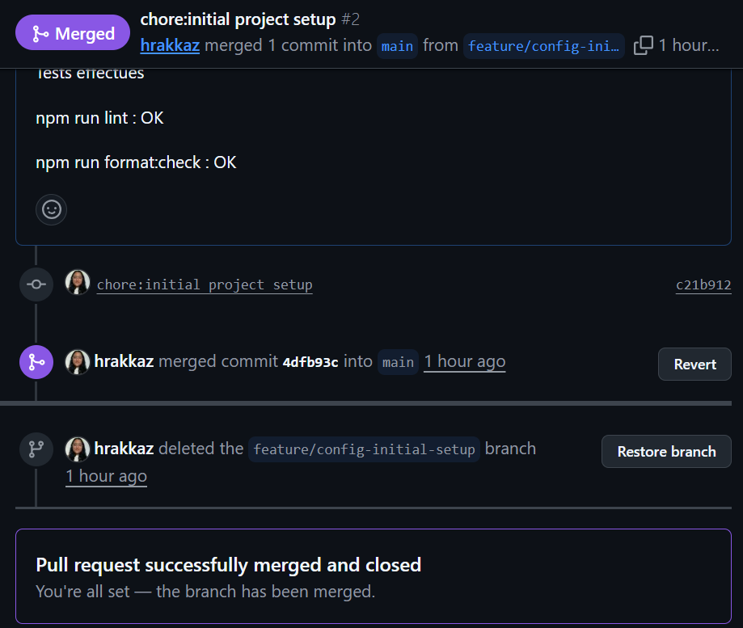
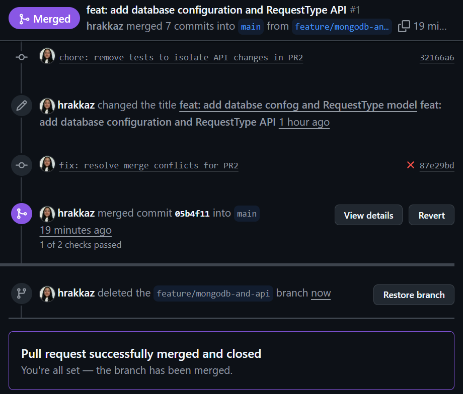
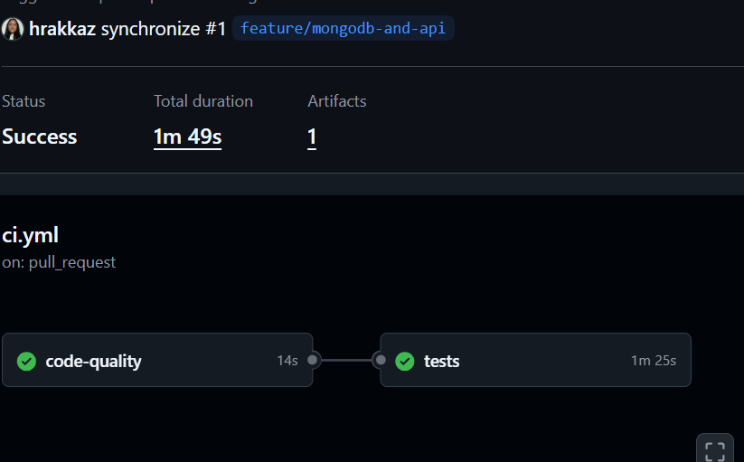
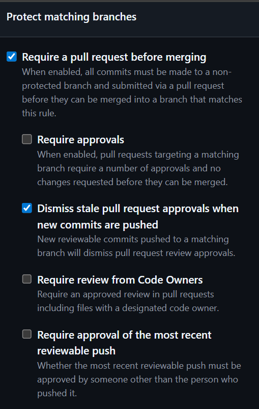
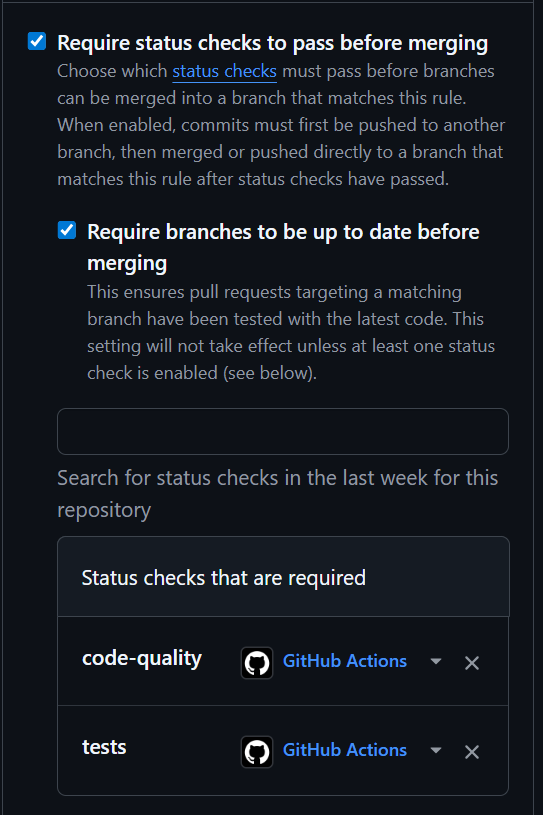

#  Support API – Projet Node.js / Express / MongoDB

Ce projet est une API REST permettant de gérer des *Request Types* (types de demandes).
Il a été développé dans le cadre du module **Git : au-delà du versioning** et met en œuvre :

- Git avancé : branches, PR, règles de protection, CI, merge, résolution de conflits  
- Node.js / Express  
- MongoDB & Mongoose  
- GitHub Actions (CI)  
- Jest & Supertest (tests automatisés)

---

# Fonctionnalités principales

- Health Check : `/health`
- CRUD partiel pour les Request Types :
  - `GET /api/request-types` → liste des types
  - `GET /api/request-types/:id` → récupérer un type spécifique
  - `POST /api/request-types` → créer un type
- Validation des données
- Seed initial de la base MongoDB
- Tests automatisés avec couverture > 90%
- Pipeline CI :
  - ESLint
  - Prettier
  - Tests Jest
  - Artefact de couverture

---

# Technologies utilisées

- **Node.js**
- **Express**
- **MongoDB**
- **Mongoose**
- **Jest**
- **Supertest**
- **GitHub Actions**
- **ESLint (flat config)**
- **Prettier**

---

#  Structure du projet

```

support-api/
├── src/
│   ├── config/
│   │   └── database.js
│   ├── models/
│   │   └── RequestType.js
│   ├── routes/
│   │   └── requestTypes.js
│   └── server.js
├── scripts/
│   └── seed.js
├── tests/
│   └── requestTypes.test.js
├── .github/workflows/
│   └── ci.yml
├── .gitignore
├── package.json
├── eslint.config.js
├── .prettierrc
└── README.md

````

---

# Installation & Lancement

## 1️Installer les dépendances

```bash
npm install
````

## 2️ Lancer MongoDB

Assure-toi que ton serveur MongoDB tourne sur :

```
mongodb://localhost:27017/
```

## 3️ Seed de la base

```bash
npm run seed
```
[
  {
    "code": "IT_SUPPORT",
    "name": "Technical Support",
    "description": "Assistance for technical issues",
    "priority": "high",
    "category": "IT",
    "estimatedResponseTime": 4
  },
  {
    "code": "ACCOUNT_RESET",
    "name": "Account Reset",
    "description": "Password or account reset",
    "priority": "medium",
    "category": "Authentication",
    "estimatedResponseTime": 2
  },
  {
    "code": "SOFTWARE_INSTALL",
    "name": "Software Installation",
    "description": "Request for a software installation",
    "priority": "low",
    "category": "IT",
    "estimatedResponseTime": 24
  },
  {
    "code": "ACCESS_REQUEST",
    "name": "Access Request",
    "description": "Demanding access to a system",
    "priority": "medium",
    "category": "Security",
    "estimatedResponseTime": 12
  },
  {
    "code": "INCIDENT_REPORT",
    "name": "Incident Report",
    "description": "Reporting a security or technical incident",
    "priority": "high",
    "category": "Security",
    "estimatedResponseTime": 1
  }
]

## 4️ Lancer le serveur en mode dev

```bash
npm run dev
```

L’API tourne sur :
👉 `http://localhost:3000`

---

# Tests automatisés (Jest + Supertest)

Lancer les tests :

```bash
npm test
```

Un rapport de couverture est généré dans `/coverage`.

---

# Workflow Git – PR et CI

Le projet respecte le workflow demandé :

## ✔ PR1 : Configuration initiale

* Structure du projet
* ESLint (flat config)
* Prettier
* Scripts npm
* PAS de CI
* PAS de code métier
* **Passée en bypass comme attendu**



---

## ✔ PR2 : API + MongoDB + CI

* Modèle Mongoose
* Routes Express
* Seed
* CI GitHub Actions (lint + format + tests)
* Résolution de conflits avec `main`




---

## ✔ PR3 : Tests + README final

* Tests Jest + Supertest (>90% couverture)
* README final
* Toutes les captures du projet
* Badge CI

 *Insérer ici la capture PR3*

---

#  Règles de protection de branche

Les règles suivantes ont été appliquées sur `main` :

* Require PR before merging
* Require branch to be up to date
* Require passing status checks

  * `code-quality`
  * `tests`




---

# Badge CI

*(À ajouter après merge final)*

```

```


---

# Endpoints de l’API

## ➤ GET /health

```json
{
  "status": "ok"
}
```

## ➤ GET /api/request-types
Retourne la liste complète des types de demandes.

## ➤ GET /api/request-types/:id
Retourne un type de demande spécifique.


## ➤ POST /api/request-types

Body :

```json
{
  "code": "IT-001",
  "name": "Request type",
  "description": "Description",
  "priority": "high",
  "category": "Tech",
  "estimatedResponseTime": 24
}
```

---

#  Objectif pédagogique

Ce projet démontre la maîtrise de :

* Git avancé
* Pull Requests correctement structurées
* Branches de fonctionnalités
* Workflow CI automatisé
* Résolution de conflits
* Bonnes pratiques Node.js
* Tests automatisés
* Documentation claire et complète

---

#  Projet terminé

Ce README fait partie de la PR3 et valide la dernière étape du projet.


